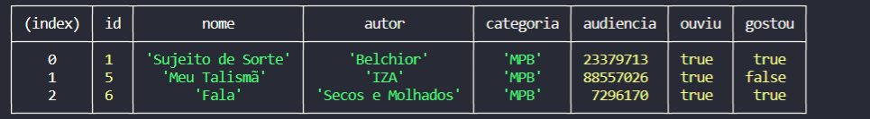

# Buscador para Músicas - Com J.S. - Adaptado.

<p align="center">Projeto solicitado no XP 44 da <a href="https://gama.academy"> Gama Academy</a>.</p>
<hr>


<br>

[](https://shields.io/)

<hr>


<h2>💻 Sobre o projeto</h2>
<p>Projeto solicitado pela Gama Academy e adaptado utilizando o projeto solicitado  <a href="https://github.com/simaraconceicao">Simara Conceição</a> de forma assíncrona. O objetivo é usar os conhecimentos de JavaScript básico e avançado para criar um buscador no console por tipo de músicas.</p>

<br>

### ✔️ Etapas:

> Passo a passo:
1) Vamos criar uma pasta e seguir os passos abaixo:
Passo 1: npm init -y

Passo 2: npm i --save readline-sync 

Passo 3: crie o script de start

Passo 4: criar .gitignore

Passo 5: criar um arquivo que simula uma database, com um array de objetos, não esquecer de exportar

Passo 6: criar o arquivo app.js

Passo 9: Rodar projeto npm start
**`E partiu codar!`**


2) No arquivo database crie e exporte a sua base no formato array de objetos contendo algumas das músicas que você já escutou  com os seguintes campos:

```
nome: string
categoria: string
autor: string
audiencia: number
ouviu: boolean
gostou: boolean
```

3) No arquivo app.js desenvolva sua lógica para o comportamento abaixo: 
  - deverá ser possível buscar musicas pela categoria
  - caso a pessoa usuária não escolha buscar, deverá mostrar todos as musicas cadastradas, ordenados de forma crescente por quantidade de ouvintes.


### 🛠 Tecnologias

As seguintes ferramentas foram usadas na construção do projeto:

- [JavaScript](https://developer.mozilla.org/en/JavaScript)

<hr>

### Saída de Dados:


### Autor
---

<p>
 
 <br />
 <sub><b>Marcos Teixeira</b></sub></p>
 <p>Solicitado por <a href="https://github.com/gamaacademy">Gama Academy</a></p>


Feito com ❤️ por Marcos Teixeira

[](https://www.linkedin.com/in/marcos-teixeira-jr2022/) 
[](mailto:marcxstx@gmail.com)


